# ERD Conceptual — Arena3 Sports Center
> Trích xuất từ 4 file SQL: 0002_arena3.sql, 0021_phase4c_training.sql, 0018_provider_sequences.sql, auth/0001_auth.sql
> **Tổng cộng: 42 bảng**
>
> **Cách dùng với draw.io:**
> 1. Vào https://app.diagrams.net/
> 2. Chọn Extras → Edit Diagram (hoặc Ctrl+Shift+X)
> 3. Dán toàn bộ khối Mermaid bên dưới vào

```mermaid
erDiagram

  %% ============================================================
  %% NHOM 1: NGUOI DUNG & HOI VIEN
  %% ============================================================

  users {
    UUID id PK
    string member_code
    string full_name
    string phone
    string email
    enum role
    enum status
    date date_of_birth
  }

  training_profiles {
    UUID user_id PK,FK
    string goal
    timestamp updated_at
  }

  member_levels {
    UUID user_id PK,FK
    enum sport PK
    string level
    UUID assessed_by FK
    timestamp updated_at
  }

  %% ============================================================
  %% NHOM 2: GOI HOI VIEN & DANG KY
  %% ============================================================

  membership_plans {
    UUID id PK
    string name
    enum sport_scope
    int duration_days
    int session_quota
    int court_hours
    int price_vnd
    bool is_on_sale
  }

  subscriptions {
    UUID id PK
    UUID user_id FK
    UUID plan_id FK
    enum sport_scope
    date start_on
    date end_on
    enum status
    numeric court_hours_left
    int session_left
  }

  %% ============================================================
  %% NHOM 3: SAN & LICH CHIEM DUNG
  %% ============================================================

  courts {
    UUID id PK
    string court_code
    enum sport
    enum status
    bool convertible
    UUID pair_court_id FK
  }

  occupancies {
    UUID id PK
    UUID court_id FK
    timestamp start_at
    timestamp end_at
    enum kind
    UUID ref_id
  }

  price_rules {
    UUID id PK
    enum sport
    UUID court_id FK
    string day_kind
    time start_local
    time end_local
    int price_vnd
    bool is_peak
  }

  %% ============================================================
  %% NHOM 4: LOP HOC & BUOI TAP
  %% ============================================================

  classes {
    UUID id PK
    enum sport
    string level
    UUID coach_id FK
    UUID assistant_id FK
    UUID court_id FK
    int capacity
    int enrolled_count
    string rrule
    date start_on
    date end_on
    enum status
  }

  sessions {
    UUID id PK
    UUID class_id FK
    UUID court_id FK
    timestamp start_at
    timestamp end_at
    enum status
    UUID occupancy_id FK
  }

  coach_sports {
    UUID user_id PK,FK
    enum sport PK
  }

  coach_occupancies {
    UUID id PK
    UUID coach_id FK
    UUID session_id FK
    timestamp start_at
    timestamp end_at
  }

  enrollments {
    UUID id PK
    UUID class_id FK
    UUID user_id FK
    enum status
    int waitlist_pos
  }

  waitlist_offers {
    UUID id PK
    UUID enrollment_id FK
    timestamp expires_at
    enum status
  }

  attendance {
    UUID id PK
    enum kind
    UUID user_id FK
    UUID session_id FK
    enum result
    timestamp at
  }

  training_plans {
    UUID id PK
    string scope
    UUID class_id FK
    UUID user_id FK
    UUID session_id FK
    UUID created_by FK
    bool published
    json payload
  }

  %% ============================================================
  %% NHOM 5: KET QUA & DANH GIA HLV (Phase 4C)
  %% ============================================================

  session_results {
    UUID id PK
    UUID session_id FK
    UUID user_id FK
    smallint plan_pct
    json metrics
    UUID recorded_by FK
    timestamp recorded_at
  }

  progress_reviews {
    UUID id PK
    UUID user_id FK
    enum sport
    UUID coach_id FK
    smallint period_weeks
    smallint technique
    smallint fitness
    smallint attitude
    timestamp created_at
  }

  coach_notes {
    UUID id PK
    UUID user_id FK
    UUID coach_id FK
    text body
    timestamp created_at
  }

  homework {
    UUID id PK
    UUID coach_id FK
    UUID class_id FK
    UUID user_id FK
    string title
    json checklist
    date due_on
  }

  homework_recipients {
    UUID homework_id PK,FK
    UUID user_id PK,FK
    json done_items
    timestamp completed_at
  }

  %% ============================================================
  %% NHOM 6: DAT SAN
  %% ============================================================

  court_bookings {
    UUID id PK
    string code
    UUID court_id FK
    UUID user_id FK
    string guest_name
    string guest_phone
    timestamp start_at
    timestamp end_at
    enum status
    int price_vnd
    UUID occupancy_id FK
  }

  %% ============================================================
  %% NHOM 7: THANH TOAN & HOA DON
  %% ============================================================

  cashier_shifts {
    UUID id PK
    UUID receptionist_id FK
    timestamp opened_at
    timestamp closed_at
    int cash_declared_vnd
  }

  payments {
    UUID id PK
    string code
    UUID user_id FK
    UUID shift_id FK
    enum method
    int amount_vnd
    enum status
    string ref_type
    UUID ref_id
    UUID created_by FK
    timestamp created_at
  }

  invoices {
    UUID id PK
    string code
    UUID payment_id FK
    string buyer_name
    string buyer_tax_code
    timestamp issued_at
  }

  invoice_lines {
    UUID id PK
    UUID invoice_id FK
    text description
    int qty
    int unit_vnd
    int amount_vnd
  }

  %% ============================================================
  %% NHOM 8: THIET BI
  %% ============================================================

  equipment_items {
    UUID id PK
    string sku
    string name
    enum sport
    int stock
    int rent_vnd
  }

  equipment_loans {
    UUID id PK
    UUID item_id FK
    UUID booking_id FK
    string phone
    int qty
    enum status
    timestamp due_at
  }

  %% ============================================================
  %% NHOM 9: HO TRO & VAN HANH
  %% ============================================================

  tickets {
    UUID id PK
    UUID user_id FK
    text body
    string status
    timestamp created_at
  }

  audit_logs {
    bigint id PK
    timestamp at
    UUID actor_id
    string action
    string entity
    UUID entity_id
    json before
    json after
  }

  feature_flags {
    string key PK
    bool enabled
  }

  code_counters {
    string kind PK
    int yyyy PK
    int n
  }

  idempotency_keys {
    string key PK
    UUID user_id
    string method
    text path
    int response_code
    json response_body
  }

  center_settings {
    smallint id PK
    string timezone
    string currency
    time open_time
    time close_time
    int slot_minutes
    numeric vat_rate
  }

  sessions_auth {
    UUID id PK
    UUID user_id FK
    text token_hash
    timestamp expires_at
  }

  otp_challenges {
    UUID id PK
    string phone
    string purpose
    text otp_hash
    timestamp expires_at
    int attempts
  }

  outbox {
    UUID id PK
    string channel
    string template
    UUID user_id FK
    json payload
    string dedupe_key
    timestamp sent_at
  }

  provider_sequences {
    string provider PK
    bigint last_order_code
    timestamp updated_at
    text note
  }

  %% ============================================================
  %% NHOM 10: BETTER AUTH (thu vien ngoai)
  %% ============================================================

  ba_user {
    text id PK
    text name
    text email
    bool emailVerified
  }

  ba_session {
    text id PK
    text userId FK
    text token
    timestamp expiresAt
  }

  ba_account {
    text id PK
    text userId FK
    text providerId
    text accountId
  }

  ba_verification {
    text id PK
    text identifier
    text value
    timestamp expiresAt
  }

  %% ============================================================
  %% RELATIONSHIPS
  %% ============================================================

  users ||--o{ subscriptions        : "user_id"
  users ||--o{ coach_sports         : "user_id"
  users ||--o{ enrollments          : "user_id"
  users ||--o{ attendance           : "user_id"
  users ||--o{ court_bookings       : "user_id"
  users ||--o{ sessions_auth        : "user_id"
  users ||--o{ outbox               : "user_id"
  users ||--o{ tickets              : "user_id"
  users ||--o{ training_plans       : "user_id"
  users ||--o{ payments             : "user_id"
  users ||--o| training_profiles    : "user_id"
  users ||--o{ member_levels        : "user_id"
  users ||--o{ session_results      : "user_id"
  users ||--o{ progress_reviews     : "user_id"
  users ||--o{ coach_notes          : "user_id"
  users ||--o{ homework             : "user_id"
  users ||--o{ homework_recipients  : "user_id"
  users ||--o{ classes              : "coach_id"
  users ||--o{ coach_occupancies    : "coach_id"
  users ||--o{ progress_reviews     : "coach_id"
  users ||--o{ coach_notes          : "coach_id"
  users ||--o{ homework             : "coach_id"
  users ||--o{ session_results      : "recorded_by"
  users ||--o{ member_levels        : "assessed_by"
  users ||--o{ training_plans       : "created_by"
  users ||--o{ payments             : "created_by"
  users ||--o{ cashier_shifts       : "receptionist_id"

  membership_plans ||--o{ subscriptions : "plan_id"

  courts ||--o{ occupancies         : "court_id"
  courts ||--o{ court_bookings      : "court_id"
  courts ||--o{ classes             : "court_id"
  courts ||--o{ sessions            : "court_id"
  courts ||--o{ price_rules         : "court_id"
  courts ||--o| courts              : "pair_court_id"

  classes   ||--o{ sessions         : "class_id"
  classes   ||--o{ enrollments      : "class_id"
  classes   ||--o{ training_plans   : "class_id"
  classes   ||--o{ homework         : "class_id"

  occupancies ||--o| sessions       : "occupancy_id"
  occupancies ||--o| court_bookings : "occupancy_id"

  sessions  ||--o{ coach_occupancies : "session_id"
  sessions  ||--o{ attendance        : "session_id"
  sessions  ||--o{ session_results   : "session_id"
  sessions  ||--o{ training_plans    : "session_id"

  enrollments ||--o{ waitlist_offers : "enrollment_id"

  cashier_shifts ||--o{ payments    : "shift_id"
  payments ||--o| invoices          : "payment_id"
  invoices  ||--o{ invoice_lines    : "invoice_id"

  equipment_items ||--o{ equipment_loans : "item_id"
  court_bookings  ||--o{ equipment_loans : "booking_id"

  homework ||--o{ homework_recipients : "homework_id"

  ba_user ||--o{ ba_session         : "userId"
  ba_user ||--o{ ba_account         : "userId"
```

---

## Bang tong hop 42 bang

| Nhom | Cac bang |
|------|----------|
| Nguoi dung | users, training_profiles, member_levels |
| Goi hoi vien | membership_plans, subscriptions |
| San & lich | courts, occupancies, price_rules |
| Lop hoc & buoi tap | classes, sessions, coach_sports, coach_occupancies, enrollments, waitlist_offers, attendance, training_plans |
| Ket qua HLV (Phase 4C) | session_results, progress_reviews, coach_notes, homework, homework_recipients |
| Dat san | court_bookings |
| Thanh toan | cashier_shifts, payments, invoices, invoice_lines |
| Thiet bi | equipment_items, equipment_loans |
| Ho tro & van hanh | tickets, audit_logs, feature_flags, code_counters, idempotency_keys, center_settings, sessions_auth, otp_challenges, outbox, provider_sequences |
| Better Auth | ba_user, ba_session, ba_account, ba_verification |
